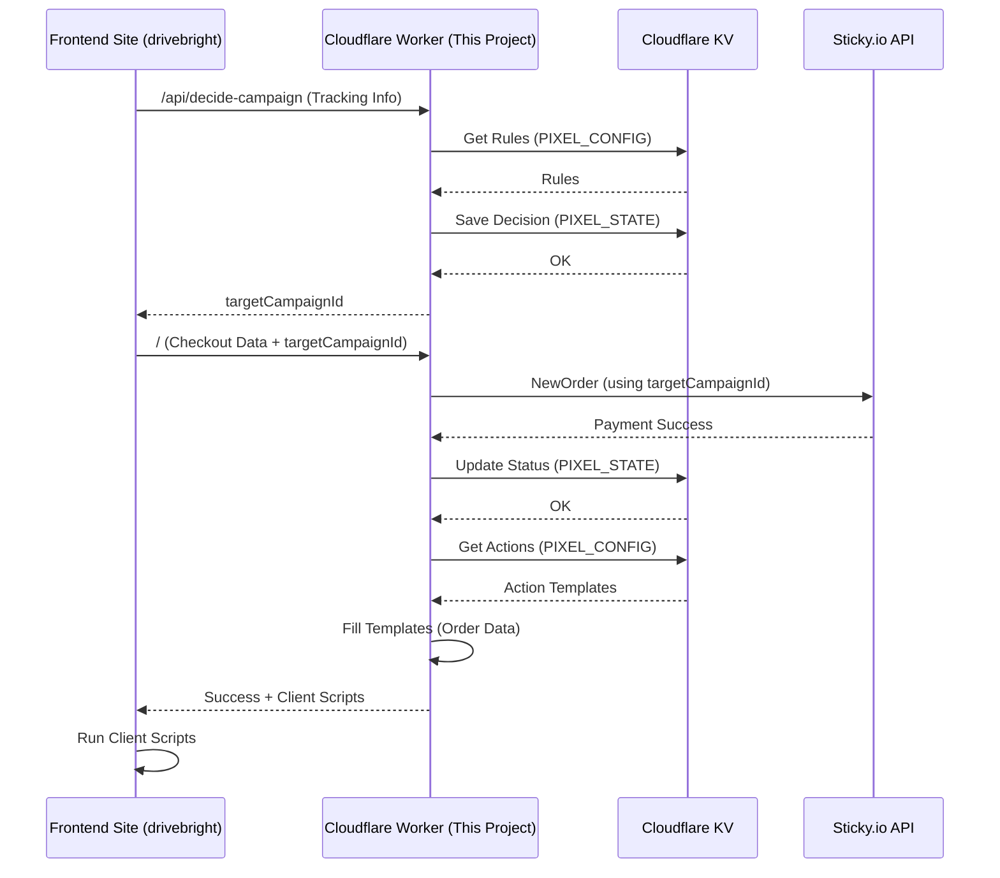

# Project Overview: Cloudflare Worker Pixel Router (`server_cloudflare_tech`)

## 1. Purpose: What does this project do?

This project is a Cloudflare Worker that acts as a smart traffic controller for tracking pixels and server-to-server calls (like sending purchase data to ad platforms). It sits between the website selling products (like `drivebright`) and the backend systems (like Sticky.io for payments and various ad platforms).

Its main jobs are:

*   **Decide which tracking to use:** Based on where the website visitor came from (e.g., which ad they clicked), it decides if certain tracking should be "scrubbed" (ignored or modified).
*   **Manage the checkout process:** It talks to the payment processor (Sticky.io) to handle purchases and upsells.
*   **Fire tracking pixels/calls:** After a successful payment, it sends the correct tracking information to ad platforms (like Facebook, Google Analytics, Everflow).
*   **Provide a management interface:** It offers secure API endpoints so an Admin UI can change settings and rules.

## 2. Architecture: How is it built?

*   **Cloudflare Worker:** The core logic runs as a serverless function on Cloudflare's edge network, making it fast and scalable.
*   **TypeScript:** The code is written in TypeScript for better organization and error checking.
*   **Cloudflare KV (Key-Value Store):** Used like a small database to store:
    *   `PIXEL_CONFIG`: Settings, rules for scrubbing, and templates for tracking pixels/calls. This is managed by the Admin UI.
    *   `PIXEL_STATE`: Temporary information about each visitor's checkout attempt (like their tracking details, which step they are on, and whether their payment succeeded). This data usually expires after a day or two.
*   **Hono Router:** A library used inside the worker to direct incoming web requests to the correct piece of code (like handling `/api/decide-campaign` or `/admin/api/kv`).

## 3. Core Workflow: How does it work?

Here's a simplified flow for a customer buying something:

1.  **Visitor Arrives:** The website (`drivebright`) tells the Worker about the visitor (e.g., `affId=nva`, `c1=123`).
2.  **Worker Decides Campaign:** The website asks the Worker (`/api/decide-campaign`) which payment campaign to use. The Worker checks rules in `PIXEL_CONFIG` (based on `affId`, `c1`) and decides if the order should be "scrubbed". It saves this decision and the visitor's details in `PIXEL_STATE` and tells the website which `targetCampaignId` to use.
3.  **Website Submits Checkout:** The website sends the customer's order details and payment info to the Worker's main `/` endpoint, including the `targetCampaignId`. It also sends headers (`X-Site-ID`, `X-Sticky-Url-Id`) so the worker knows which site configuration and Sticky.io endpoint to use.
4.  **Worker Processes Payment:** The Worker talks to Sticky.io's API (`NewOrder`) using the `targetCampaignId`.
5.  **Payment Success:** If Sticky.io confirms the payment:
    *   The Worker updates the status in `PIXEL_STATE`.
    *   It looks up which tracking actions to perform in `PIXEL_CONFIG` (based on site, scrub status, etc.).
    *   It fetches the templates for those actions (e.g., Facebook Purchase pixel template).
    *   It fills in the templates with real data (order ID, price, customer email from the Sticky.io response and `PIXEL_STATE`).
    *   It sends server-side tracking calls directly (e.g., to Facebook CAPI).
    *   It sends back any client-side tracking code (like JavaScript snippets) to the website to run in the visitor's browser.
6.  **Website Shows Confirmation:** The website gets the success message and runs any client-side scripts provided by the Worker.
7.  **Upsells:** Similar process for upsells, using the `/api/upsell` endpoint. The Worker uses the *original* scrub decision stored in `PIXEL_STATE` to ensure consistency.

*(See the Mermaid diagram below for a visual representation)*

## 4. Key Components/Files: What do important files do?

*   `wrangler.toml`: Configuration file for the Cloudflare Worker (name, routes, KV bindings like `PIXEL_CONFIG` and `PIXEL_STATE`).
*   `tsconfig.json`: Settings for the TypeScript compiler.
*   `package.json`: Lists project dependencies (libraries used) and scripts (like `npm run deploy`).
*   `src/index.ts`: The main entry point for the Worker. It sets up the router (Hono) and defines the main request handler.
*   `src/router.ts`: Defines all the API routes (`/`, `/api/decide-campaign`, `/api/upsell`, `/admin/api/*`) and links them to specific handler functions.
*   `src/handlers/`: Folder containing functions that handle specific requests:
    *   `decideCampaign.ts`: Logic for the `/api/decide-campaign` endpoint.
    *   `checkout.ts`: Logic for the main `/` endpoint (processing payments).
    *   `upsell.ts`: Logic for the `/api/upsell` endpoint.
    *   `paypalReturn.ts`: Logic for handling redirects back from PayPal.
    *   `adminAuth.ts`: Handles login for the Admin UI.
    *   `pagePixels.ts`: (Potentially used for simpler pixel logic outside checkout).
*   `src/actions.ts`: Contains the core logic for triggering tracking actions (`triggerInitialActions`, `triggerUpsellActions`). It reads state, checks idempotency, fetches action definitions from KV, populates parameters, and executes actions.
*   `src/config.ts`: Might contain helper functions for reading configuration from KV or environment variables.
*   `src/lib/sticky.ts`: Contains functions specifically for interacting with the Sticky.io API.
*   `src/utils/`: Utility functions (e.g., `parameters.ts` for replacing `PARAM:` placeholders in action templates).
*   `src/admin/`: Code related to the Admin API:
    *   `router.ts`: Defines admin-specific routes (`/admin/api/*`).
    *   `api/config.ts`, `api/kv.ts`: Handlers for managing site configurations and raw KV entries.
    *   `middleware/auth.ts`: Checks the JWT token for secure admin access.
*   `src/types.ts`, `src/admin/types.ts`: Define the structure (types) of data objects used throughout the code (like the format of KV entries or API request bodies).

## 5. Configuration: How is it set up?

*   **Development Environment:**
    *   The typical development terminal used is Git Bash.

*   **Environment Variables/Secrets (in Cloudflare Dashboard):**
    *   `STICKY_API_USERNAME`, `STICKY_API_PASSWORD`: Credentials for Sticky.io.
    *   `JWT_SECRET`: A secret key used for signing Admin UI login tokens.
    *   `FB_ACCESS_TOKEN`, `FB_PIXEL_ID`, `FB_TEST_CODE`: Credentials/IDs for Facebook CAPI.
    *   *(Potentially others for different integrations)*
*   **KV Namespaces (Bound in `wrangler.toml` and created in Cloudflare):**
    *   `PIXEL_CONFIG`: Stores persistent rules and action templates. Keys often look like `drivebright_rule_checkoutNormalActions` or `action_FacebookPurchase`. Managed via the Admin UI or `wrangler kv` commands.
    *   `PIXEL_STATE`: Stores temporary transaction state. Keys look like `txn_{internal_txn_id}`. Automatically managed by the worker.
*   **`wrangler.toml`:** Defines bindings to KV namespaces and secrets.

## 6. Interaction: How does it connect to other projects?

*   **Frontend Site (`drivebright`):**
    *   Receives requests from the site's `pixel-router-client.ts` library at public endpoints: `/api/decide-campaign`, `/`, `/api/upsell`, `/checkout/paypal-return`.
    *   Sends back JSON responses containing success status, order details, and client-side scripts to execute.
    *   Reads `X-Site-ID` and `X-Sticky-Url-Id` headers to know which site's configuration to use.
*   **Admin UI (`cloudflare-pixel-admin-ui-website`):**
    *   Receives requests from the Admin UI at `/admin/api/*` endpoints.
    *   Requires a valid JWT `Authorization: Bearer <token>` header for most admin endpoints.
    *   Sends back JSON responses with configuration data or success/error messages.
*   **Sticky.io:**
    *   Makes outbound API calls (`NewOrder`, `new_upsell`, `order_view`) to the Sticky.io API endpoint identified by the `X-Sticky-Url-Id` header value combined with base URLs potentially stored in KV.
*   **Tracking Platforms (Facebook, Everflow, etc.):**
    *   Makes outbound server-to-server API calls based on action templates stored in `PIXEL_CONFIG`.